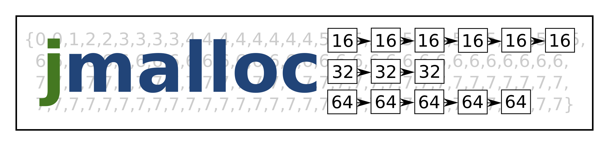

# jmalloc



jmalloc is a high-performance memory allocator on a different location of the
high performance - low fragmentation scale than most allocators out there. It
purposefully has an interface different from malloc. The difference is that
jmalloc does not store the allocated block size anywhere, so the calling
program needs to pass the block size to jmalloc when freeing a block.

Paging is needed to satisfy allocations larger than 2048 bytes, and most
importantly, to allocate the arenas. So, don't use jmalloc on a system that
lacks mmap!

## Warning

Note that the allocators as-is use `MAP_SHARED` instead of `MAP_PRIVATE`. This
means that forking and modifying the data from the forked process might not do
what you want. On the other hand, forking overheads are lower with
`MAP_SHARED`.

## Usage

How to compile:

```
make
```

How to run:

```
time ./jmalloc2
```

The variant `jmalloc2` is the current variant. The older `jmalloc` uses doubly
linked lists instead of singly linked lists.

You can compare jmalloc performance to Linux allocator or various other
allocators:

```
time ./lmalloc
LD_PRELOAD=../sfmalloc/libsfmalloc.so time ./lmalloc
LD_PRELOAD=../Hoard/src/libhoard.so time ./lmalloc
LD_PRELOAD=/usr/lib/x86_64-linux-gnu/libjemalloc.so.1 time ./lmalloc
LD_PRELOAD=/usr/lib/x86_64-linux-gnu/libtcmalloc.so.4 time ./lmalloc
```

Note the sfmalloc is buggy: it requires changing `-lpthread` to `-pthread` in
the Makefile to actually work.

## Link size

```
$ cd realapp
$ objdump -t allocreal|egrep '(text.*jm|lookup)'
0000000000000ac0 g     O .rodata  0000000000000100              lookup2
0000000000000810 g     F .text    0000000000000147              jmalloc
0000000000000bc0 g     O .rodata  0000000000000081              lookup
0000000000000960 g     F .text    00000000000000a7              jmfree
```

So, this version of jmalloc uses 879 bytes of memory, quite small for embedded
systems. Note optimizations could compress both lookup tables to one 256-byte
lookup table so it might be possible to fit jmalloc to even as small space as
768 bytes.

The simpler version of jmalloc not in the realapp directory is even smaller:
```
$ objdump -t jmalloc|egrep '(text.*jm|lookup)'
00000000000009e0 g     F .text   000000000000013c              jmalloc
0000000000000c60 g     O .rodata 0000000000000081              lookup
0000000000000b20 g     F .text   0000000000000087              jmfree
```

So, this simpler version uses only 580 bytes of memory. Note the simple version
will be slower for large allocations, but has the benefit of being simpler and
smaller.
